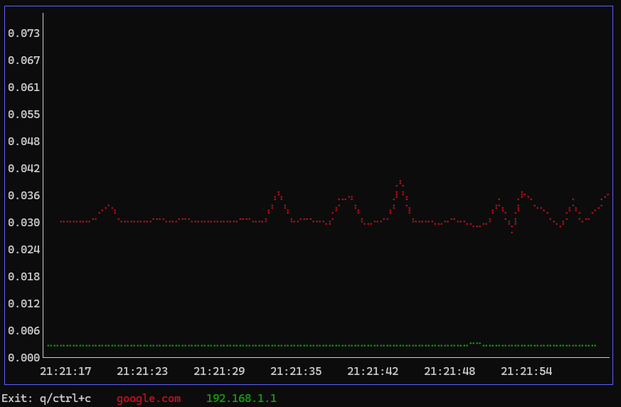

# graph-ping
Needed a tool to ping multiple hosts and save the output for later analysis. This was the result.

It's the usual clone and "go build ." if you want to build from source.  
Currently only tested on Windows. 

### TODO:
- [ ] Fix TUI zoom/scroll control
- [ ] CSV graph replay
- [ ] Proper handling of unreachable hosts (as it stands nothing is logged)


### --help
```
NAME:
   graph-ping - multi-ping TUI and logging solution

USAGE:
   graph-ping [global options]

DESCRIPTION:
   graph-ping is a tool that can ping multiple hosts, display the results in a TUI and log to a CSV

GLOBAL OPTIONS:
   --host value [ --host value ]  Provide hosts to ping. Example: graph-ping --host google.com --host 192.168.1.1
   --output value, -o value       Specify output file path. Example: ./output.csv or C:/output.csv
   --interval value, -i value     Set the interval between pings in milliseconds (default: 1000)
   --count value, -c value        Set the number of pings to send. 0: infinite (default: 0)
   --help, -h                     show help
```



Using:  
https://github.com/prometheus-community/pro-bing  
https://github.com/NimbleMarkets/ntcharts  
https://github.com/charmbracelet/bubbletea  
